# Planejamento do Pitch de 15 Minutos - Reunião de Diretoria (Board Meeting)
**Consultoria:** Squad 1 - Inteligência Antifraude  
**Cliente:** GlobalPay Solutions (Diretor Executivo / Board de Riscos)  
**Objetivo:** Defender a implantação imediata do modelo em produção traduzindo a complexidade de Machine Learning em valor financeiro direto (ROI).

---

## 📅 Estrutura Geral do Tempo (15 Minutos Cronometrados)

```mermaid
gantt
    title Distribuição do Tempo no Pitch (15 Minutos)
    dateFormat  X
    axisFormat %H:%M
    section Minutos
    1. O Problema & Perda (3m)  :active, 0, 3
    2. A Jornada Técnica SEMMA (4m) : 3, 7
    3. Demonstração ao Vivo (5m)    :crit, 7, 12
    4. ROI & Defesa do Threshold (2m) : 12, 14
    5. Q&A e Próximos Passos (1m) : 14, 15
```

---

## 🖼️ Roteiro de Slides e Discurso Recomendado

### **Slide 1: A Dor Silenciosa da GlobalPay (0:00 - 3:00)**
*   **Título do Slide:** O Custo Invisível da Fraude no Gateway B2B2C
*   **Layout Visual Sugerido:** Slide clean com dois números gigantes em destaque: 
    *   **R$ 12.500.000,00** (Prejuízo Projetado Anual sem modelo)
    *   **99.83%** (Falsa ilusão de segurança por Acurácia Cega)
*   **Pontos de Discussão:**
    *   Iniciar com empatia de negócios: "Como gateway B2B2C, a GlobalPay tem duas feridas abertas. A primeira é o chargeback (devolução da cobrança) direto (R$ 150 por fraude que passa), a segunda é o atrito que destrói vendas de bons clientes (R$ 10 por falso positivo)."
    *   "Se continuarmos aprovando transações de forma cega, perderemos R$ 17.250,00 a cada 12 horas. Isso drena o EBITDA (Lucro Antes de Juros, Impostos, Depreciação e Amortização) e a nossa reputação perante as bandeiras de cartão."
    *   "A acurácia tradicional de 99,8% é uma métrica inútil aqui. O que apresentamos hoje é uma inteligência matemática que ataca a dor financeira real."

---

### **Slide 2: A Jornada Científica - O Framework SEMMA (3:00 - 7:00)**
*   **Título do Slide:** Rigor Científico e Validação Out-Of-Time (OOT)
*   **Layout Visual Sugerido:** Diagrama linear horizontal representando o fluxo do SEMMA (Sample, Explore, Modify, Model, Assess).
*   **Pontos de Discussão:**
    *   **A Amostragem Temporal (Sample):** "Não usamos divisões aleatórias que enganam os cientistas. Treinamos o modelo com as primeiras 36 horas e testamos cegamente nas últimas 12 horas (dados OOT (out of time) que representam o 'futuro'). Se o modelo funciona aqui, ele funcionará em produção amanhã."
    *   **O Tratamento e Variáveis (Modify & Model):** "Para lidar com as compras exorbitantes (outliers), isolamos o ruído aplicando o pré-processador **RobustScaler**. Nossos testes estatísticos apontaram que as variáveis do PCA (Análise de Componentes Principais) **V17, V14 e V12** são as impressões digitais da fraude em tempo real."
    *   **A Validação de Hiperparâmetros:** "Buscamos o equilíbrio perfeito entre sub-ajuste e sobre-ajuste na Random Forest. Limitando a profundidade em **max_depth=10** e forçando pesos balanceados, construímos um algoritmo que retém um espetacular **PR-AUC (Área sob a curva de Precisão-Recall) de 0.8076 (80,76%)** no teste temporal cego."

---

### **Slide 3: Demonstração ao Vivo do Produto (7:00 - 12:00)**
*   **Ação Principal:** Compartilhar a tela e realizar o processamento em tempo real no aplicativo Streamlit.
*   **Script e Sequência de Demonstração:**
    1.  **Apresentar a Interface:** "Esta é a central de decisão da GlobalPay Solutions. Projetada para ser amigável, direta e visual."
    2.  **Fazer o Carregamento:** "Vamos simular o fechamento de um lote. Vou carregar o arquivo `{clientes_do_dia.csv}` que contém 92.575 transações processadas nas últimas 12 horas." (Mostrar o app calculando).
    3.  **Simular o Impacto:** 
        *   "Se usarmos o limiar de 50% (extremamente conservador, focado em evitar atrito inútil de suporte), o app mostra que capturamos 71,3% das fraudes operando com quase zero falsos positivos. Nossa perda cai para R$ 4.960,00, **salvando R$ 12.290,00** líquida imediatamente."
        *   "Agora, vejam a mágica do ajuste fino de risco em tempo real. Se reduzirmos o limiar de bloqueio/auditoria para 20%, o painel recalcula instantaneamente. Capturamos 77,4% das fraudes. Assumimos um custo marginal de R$ 340,00 em verificações de falso alarme, mas o prejuízo total despenca para R$ 4.240,00, gerando **R$ 13.010,00 de economia líquida** para a GlobalPay."
    4.  **Investigação de Transações:** Mostrar a tabela interativa ordenada por risco decrescente: "O analista de risco pode filtrar apenas as transações marcadas como 'Bloquear' ou 'Revisar' e inspecionar os scores em tempo real, baixando o lote enriquecido para conciliação bancária."

---

### **Slide 4: O Clímax Financeiro e Recomendação (12:00 - 14:00)**
*   **Título do Slide:** R$ 13.010,00 Economizados a Cada 12 Horas
*   **Layout Visual Sugerido:** Tabela simples comparando os cenários operacionais (Sem Modelo, Threshold 50%, Threshold 20%) destacando em verde neon a economia líquida e o ROI de **75,4%**.
*   **Pontos de Discussão:**
    *   "Nossa decisão estratégica não é puramente matemática; é financeira. Proponho que comecemos operando com o **Threshold (limiar) de 20%**."
    *   "Essa escolha gera a maior eficiência de capital possível: reduzimos a perda de fraudes em 75,4%. Anualizando esse ganho líquido temporal do lote, estamos injetando **mais de R$ 9.497.000,00 de volta ao fluxo de caixa da GlobalPay Solutions** em perdas que simplesmente deixaram de existir."
    *   "Este modelo não é uma despesa de TI. É um centro gerador de lucros operacionais direto."

---

### **Slide 5: Q&A e Próximos Passos (14:00 - 15:00)**
*   **Título do Slide:** Rollout Técnico e Próximos Passos
*   **Layout Visual Sugerido:** Cronograma de 3 passos simples de implantação da API.
*   **Pontos de Discussão:**
    *   "Nossa proposta é um rollout (lançamento) controlado: 
        1. Integração do modelo `.pkl` via microsserviço de API nas transações de cartão em ambiente de sandbox (Semana 1).
        2. Operação em modo shadow (prevendo sem bloquear) para verificar a aderência real (Semana 2).
        3. Ativação completa em produção com threshold padrão de 20% (Semana 3)."
    *   "Agradeço a atenção e ficamos à disposição do conselho diretor."

---
